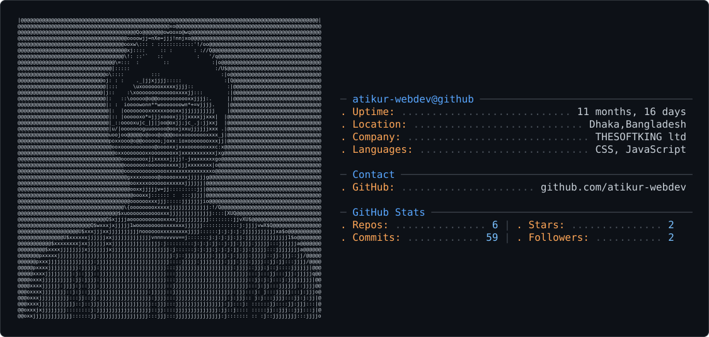

  
<picture>
  <source media="(prefers-color-scheme: dark)" srcset="./dark_mode.svg">
  <source media="(prefers-color-scheme: light)" srcset="./light_mode.svg">
  
</picture>

<h1>Atikur Rahman</h1>

 

 

Passionate about building scalable web applications with Laravel, PHP, MySQL and modern web technologies.

 

<picture>
  
</picture>

<picture>
  
</picture>

<picture>
  
</picture>

<picture>
  
</picture>

<picture>
  
</picture>

<picture>
  
</picture>

---

## 👨‍💻 About Me

I'm a Software Developer focused on building reliable and scalable web applications.

- 💻 Backend development with **Laravel, PHP & MySQL**
- ⚛️ Currently expanding my skills with **React**
- 🏗️ Interested in **API development, system design & scalable architectures**
- 🚀 Passionate about writing clean, maintainable and efficient code

---

## 📊 GitHub Stats

<!-- 

 -->

---

---

## 📊 GitHub Statistics

---

## 🔥 GitHub Streak

---

## 🚀 What I Build

I focus on developing backend-driven web applications with an emphasis on
clean architecture, maintainable code, and reliable APIs.

### Backend Development
- RESTful API development with **Laravel**
- Authentication & authorization systems
- Database design and optimization with **MySQL**
- Role-based access control
- Payment and transaction workflows
- Third-party API integrations

### Full-Stack Development
- Building modern interfaces with **React**
- Integrating React applications with Laravel APIs
- Developing responsive web applications
- Working with modern JavaScript technologies

### Engineering Focus
- Clean and maintainable code
- Scalable application architecture
- Database-driven systems
- API design and integration
- System design fundamentals

---

## 🌐 Connect With Me

